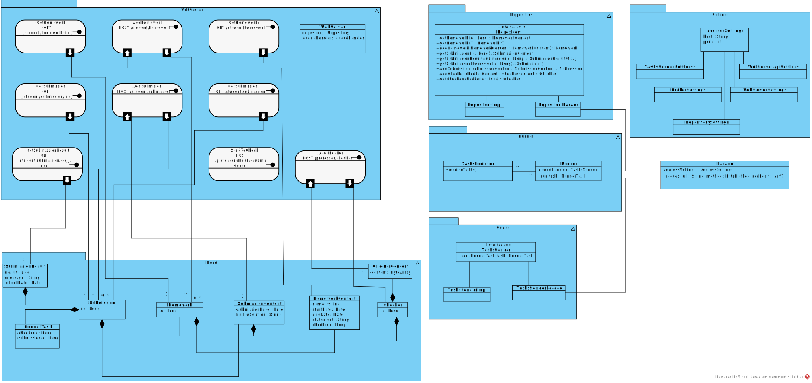

# Архитектура игры WitcherRogue

## Разработчики

- Лебедев Егор
- Карнаухов Кирилл
- Худяков Юрий
- Сурков Петр

## Общие сведения о системе

### Назначение

WitcherRogue -- игра с тайловой графикой в жанре Rogue-like.

### Описание

Есть главный герой, которым управляет игрок. Он попадает на уровень, в котором должен убить босса. Сделать это сразу он,
вероятно, не сможет. Сначала придётся убивать мелких мобов и собирать улучшения для героя:
новое оружие, зелья и броню. В игре также есть таймер, засекающий время одной игры.

### Границы системы

- Игра предназначена для одного человека, для игры на одном компьютере
- В игре поддерживается только тайловая графика и тайловое позиционированние персонажа на карте
- Время в игре дискретно и измеряется тиками (равным, например, 1мс)
- Поддерживается управление только с помощью клавиатуры

### Контекст системы

Игра должна запускаться без необходимости установки сторонних библиотек и на всех основных платформах.

## Architectural drivers

### Технические ограничения

Для выбранного языка должен существовать игровой движок с тайловой графикой

### Бизнес-ограничения

- Результат через 2 месяца
- Высокая оценка по SD

### Качественные характеристики системы

- Сопровождаемость: с системой удобно работать, есть тесты
- Расширяемость: легко добавить новых мобов и предметы, а также свои карты

### Ключевые функциональные требования

- В игре тайловая графика, вид сверху
- В игре есть герой, способный перемещаться по карте в 4 основных направлениях и управляемый пользователем игры
- Время в игре дискретно и измеряется тиками
- Игру нельзя сохранить или загрузить, весь прогресс после смерти героя сбрасывается
- Игровой мир состоит из тайлов, в каждом тайле может находиться лишь одна сущность: герой, моб, стена, улучшение для
    героя
- Герой атакует рядом находящихся соперников
- В игре есть только ближний бой. Для атаки героя должны находиться на соседних тайлах. Бой происходит автоматически,
  результат зависит от параметров оружия (у оружия есть вилка в рамках которой наносится урон) и героя.
- Бой происходит автоматически
- В игре есть враждебные мобы, из убийства которых выпадают предметы
- Зелья могут влиять на характеристики героя и врагов
- Язык английский, но есть возможность добавить перевод на другие языки

## Роли и случаи использования

### Роли

- Игрок
- Дизайнер уровней

Случаи использования:
- Игрок хочет сыграть. Игрок должен иметь цель, иначе ему станет скучно, поэтому игра должна быть конечной и в конце иметь босса
- Дизайнер уровней. Хочет создать уровень, и не хочет лезть в код. Значит, нужно, чтобы он менял читаемое представление уровня в файле

### Типичный пользователь

Имя: Тимофей

Возраст: 35 лет

Пользуется macos, увлекается машинным обучением, весной ездит в "отпуск". В "отпуске" любит отвлечься от работы, играя в
Rogue-like и критикуя студентов за их игры.

В играх Тимофей ценит тайловую графику и не очень любит консольную. Ему нравятся игры жанра roguelike, а также он поддерживает
инди разработчиков и небольшие проекты. Он также любит играть с друзьями, но если это невозможно - делиться с ними созданным
игровым контентом. Ему также нравится разнообразие в играх: различные существа и механики боя, а также случайные карты  

## Viewpoint

### Композиция

Архитектура MVC + модуль Logic, отвечающий за события в игре

- Logic
  - InputHandler: детектирует нажатие клавиш с клавиатуры
  - ActionsManager: управляет временем и событиями в игре
  - Strategy: стратегии поведения мобов
  - LevelBuilder: строитель уровней
  - MobsFactory: фабрика для создания мобов разных видов
- Controller
  - CharacterController: управление состоянием персонажа
    - PlayerController: управление игроком
    - MobController: управление (через стратегию) моба
  - MovementController: управление всеми передвижениями в игре
  - InventoryController: управление инвентарем персонажа
  - MapController: управление картой
  - GlobalController: управление глобальным состоянием игры (например, босс)
  - CollisionsController: управление всеми столкновениями в игре 
(например, нанесение урона при столкновении игрока и моба)
- State: хранит все данные в игре
- View: отображает игру

### Логическая структура

- InputHandler: детектирует клавиши и отправляет их в PlayerController. 
- ActionsManager: каждые Х времени (тик) вызывает метод invoke() у тех Action-ов, которые были зарегистрированы в нем.
- Action: событие, которое исполняется каждый тик. 
  - ReversibleAction - действие, у которого есть обратимый эффект и срок жизни. Обратный эффект регистрируется при запуске основного 
  эффекта и исполняется по истечении срока жизни основного эффекта
  - IrreversibleAction - действие без обратного эффекта. В основном это повторяющиеся действия, которые по завершении исполнения регистрируют себя заново, 
  но также есть и одноразовые действия
  - По большей части анонимные классы, создаваемые контроллерами, а также различные классы View для отображения
- Strategy: стратегия поведения мобов
  - AggressiveStrategy: стремится сблизиться с игроком
  - StandingStrategy: игнорирует игрока
  - CowardStrategy: стремиться отдалиться от игрока
  - ReproductiveStrategy: каждый промежуток времени с заданной вероятностью клонирует себя в соседнюю клетку. 
  От одного источника появляется ограниченное число наследников (решение для улучшения производительности игры) 
  - DynamicStrategy: стратегия с набором правил. На основе них каждых ход моба выбирается
  стратегия, которая применяется в данный ход. Например, правило "текущее здоровье <= 20% от максимального"
  меняет стратегию на трусливую
- Level: уровень (ячейки и мобы)
  - LevelBuilder: паттерн строитель, загружает уровень из файла или создает с помощью LevelGenerator
    - LevelGeneratorBuilder: паттерн строитель, конструирует генератор уровней LevelGenerator по параметров
      - LevelGenerator: класс с логикой генерации уровня. Алгоритм работы упрощенно: 
      рекурсивно делит карту пополам, получая дерево, в листьях строит комнаты с мобами и вещами, 
      поднимаясь по дереву строит коридоры между комнатами
- MobsFactory: абстрактная фабрика для генерации мобов

- State: часть состояния игры, с которым идёт взаимодействие через контроллеры
  - CollisableState: состояние объекта, который умеет сталкиваться с другими объектами
    - CharacterState: местоположение, контроллер, текущее здоровье, предметы и примененные зелья и броня.
      - PlayerState: информация о игроке
      - MobState: информация о мобе.
          - GoblinMobState: один из рядовых мобов
          - BigDemonMobState: один из мобов-боссов
          - ReproducingMoldMobState: моб с ReproductiveStrategy, является CloneableState
    - LootItemState: предмет, лежащий на карте
  - CloneableState: состояние, которое умеет клонировать себя (паттерн Прототип)
  - InventoryState: информация об инвентаре игрока или моба
    - Item.
        - Weapon: определяет диапазон урона и прочность.
        - Armor: текущее состояние брони и от чего защищает.
        - Potion: эффект зелья.
  - MapState: информация о всех тайлах на уровне.
  - CellState: информация о тайле (содержимое и местоположение)
  - GlobalState: глобальное состояние игры - прошедшее время, жив ли герой и босс
  - SettingsState: настройки игры

- Controller. Каждое действие - это регистрация Actionа в ActionsManager с выполнением нужных изменений
  - CharacterController: управление героем или мобом (перемещение, использование предметов, принятие эффекта зелья,
    использование инвентаря).
      - PlayerController: управление героем с помощью приходящей ему информации от InputHandler. Происходящие события
    запоминаются в виде Action-ов, которые каждый тик отдаются в CharacterAction и запускаются (т.е. события с клавиатуры
    применяются раз в тик)
      - MobController: управление мобом с помощью AI. Возможно, каждому мобу отдельный поток, который генерирует события моба и 
    действует аналогично PlayerController
  - InventoryController: хранит информацию о предметах внутри инвентаря у персонажа, умеет добавлять и удалять предметы.
  - MapController: контроллер для взаимодействия с картой
  - GlobalController: контроллер для взаимодействия с глобальным состоянием
  

- View. Во основном это самоповторяющиеся IrreversibleAction
  - InterfaceView.
      - InventoryView: отображение списка предметов в инвентаре.
      - HealthBar: отображение полосы с здоровьем
      - DamageBar: отображение текущего урона
      - ExperienceBar: отображение накопленного опыта и уровня
  - CharacterView: отображение тайлов персонажей
  - LootItemView: отображение предмета, лежащего на карте
  - MapView: отображение карты уровня (тайлов стен и свободного пространства).
  - CameraView: перемещает камеру Korge
  - SettingsView: отображение настроек

### Взаимодействия

Взаимодействие в игре построено на основе времени и тиков. Есть ActionsManager, в котором разные сущности игры регистрируют события. 
Каждый тик берётся список зарегистрированных событий и исполняется, после чего этот список очищается.
События могут регистрировать себя же или какие-то иные события в процессе своего исполнения, таким образом событие может повторяться бесконечно,
если оно того пожелает. Также есть обратимые события, которые имеют срок жизни, и содержат основное и обратное событие. 
При запуске обратимого события запускается основное событие, а в список отложенных событий кладётся обратное событие, и по прошествии времени так же исполняется.

Пример работы игры при нажатии клавиши движения вверх:

- Случилось нажатие клавиши
- InputHandler вызвал метод update у PlayerController (передал туда лямбду, которая вызовет метод move(Up) у PlayerController)
- PlayerController зарегстрировал событие с переданной лямбдой, в ActionsManager
- ActionsManager запустил событие на следующем тике
- PlayerController вычислил новую позицию игрока
- PlayerController вызвал метод update у себя же с лямбдой, которая обновит позицию на новую
- ActionsManager запустил событие на следующем тике
- PlayerController проверил, что позиция доступна для перемещения, у MovementController (у него внутри хранится MapState)
- Если позиция доступна, PlayerController изменит PlayerState
- В любом случае, PlayerController изменит направление взгляда игрока

Больше подробностей о происходящих в игре событиях:
- Бой: персонаж и моб атакуют друг друга в зависимости от их брони и оружия, уменьшая их здоровье. Бой заканчивается,
  когда кто-то из них умирает. Происходит, когда два враждебных персонажа стоят на соседних клетках.
- Поднятие предмета: когда персонаж подходить к предмету и решает его взять, то предмет переходит в инвентарь.
- Использование зелья: персонаж может применить зелье на себя или другого персонажа, влияя на его характеристики. Могло бы
быть отдельным состоянием (e.g. PoisonedState), но на диаграмме получится в 2 раза больше состояний и это скорее атрибут 
- Использование оружия: если у персонажа есть в инвентаре оружие, он может его взять и использовать в бою.
- Использование брони: если у персонажа есть в инвентаре броня, он может ее надеть на себя.

### Состояния

## Глобальное состояние игрока

Глобально есть состояние MenuState - просто сидим в меню, состояние WalkState - просто идём по полю, состояние FightState -
находимся в бою, состояние InventoryState - открыли инвентарь, состояние DeadState - умерли, состояние VictoryState - в бою убили босса

Также отдельно о состояниях различных элементов системы:
- Состояние героя:
    - Ведет бой.
    - Не ведет бой.
    - Открыл инвентарь
    - Умер
    - Победил
- Состояние моба:
    - Ведет бой.
    - Собирается начать бой (идет к нему).
    - Игнорирует героя.
- Состояние игры:
    - В процессе.
    - Победа.
    - Проигрыш.
- Состояние предмета:
    - Лежит на земле.
    - Использовано.
    - Лежит в инвентаре у персонажа.

## Принятые решения

Мы выбрали язык Kotlin, потому что он удобен в использовании, наша команда его хороша знает, а также в нем есть
подходящий игровой движок. Мы не выбрали C#, потому что большая часть команды не имела с ним опыта. Мы не выбрали C++,
потому что на нем намного сложнее реализовывать большие системы, а производительности Kotlin более, чем достаточно.

Для игрового движка мы выбрали [KorGE](https://korge.org/) по следующим причинам:
* В нем есть тайловая графика
* Это современный игровой движок
* Он мультиплатформенный
* В нем есть примеры реализации Rogue-like игр
